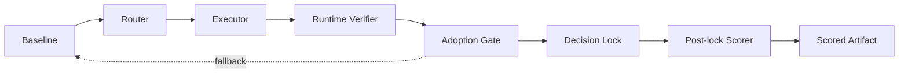

# OmarAGI Reliability BYOK Replay

[](https://github.com/effacermonexistence/omaragi-reliability-replay/actions/workflows/ci.yml)

OmarAGI Reliability BYOK Replay shows how an AI candidate moves through routing, execution, target-blind runtime verification, guarded adoption, decision lock, and post-lock scoring before it is allowed to replace a baseline response. The live [OmarAGI BYOK product](https://omaragi.com/run) lets users connect their own model key and run real model outputs through that reliability workflow. This public repository is a sanitized deterministic replay of the decision shape, making the architecture inspectable without exposing OmarAGI private production logic.

Every included repository case is synthetic, deterministic, and runnable without an API key.

## 60-second judge path

1. **See the live product:** [open OmarAGI BYOK](https://omaragi.com/run).
2. **Inspect a committed live diagnostic:** [100-case report](https://omaragi.com/results/run_1779840603_8c2cfeec9d).
3. **Check the evidence boundary:** read [`EVIDENCE.md`](EVIDENCE.md), including raw-log links, artifact hashes, and the diagnostic-only claim label.
4. **Run the public architecture:** clone this repository and execute `./scripts/quickstart.sh --check`.
5. **Inspect the lock:** open `output/judge/report.html` or `output/judge/report.json` and compare Runtime Verifier → Adoption Gate → Decision Lock → Post-lock Scorer.

## Live BYOK product and this public replay

The live [OmarAGI BYOK surface](https://omaragi.com/run) lets users supply their own API key and execute real model calls through the reliability workflow. Routing, verification, and guarded adoption are designed to prevent an unverified candidate from silently replacing the baseline.

That is the practical value of the connected product: a verified candidate can improve the delivered answer, while an unverified candidate is denied adoption and the baseline remains available. This is a reliability objective, not a guarantee that every model response or task will improve.

This repository does not call the live service, accept user API keys, or expose the private production executor. It is a sanitized deterministic offline replay of the public decision shape so judges can inspect **Router → Executor → Runtime Verifier → Adoption Gate → Decision Lock → Post-lock Scorer → Scored Artifact** without credentials or provider variability.

The committed five-case fixture is a benchmark-shaped architecture demonstration. It shows how the pipeline behaves on invented pass, rejection, and preservation cases; it is **not benchmark evidence, independent validation, or proof of universal uplift**. The practical BYOK product is the connected live path; this repository is its safe public demonstration surface.

## What it demonstrates

- Preserve the baseline response as the fallback floor.
- Route each case through a small, inspectable public policy.
- Execute a sanitized pre-generated candidate through an explicit offline executor.
- Verify the executor output with a transparent deterministic rule.
- Adopt the candidate only when verification passes.
- Preserve the original baseline when routing or verification fails.
- Hash and lock the route/adoption result before the scoring target is read.
- Score baseline and final outputs only after the decision lock exists.
- Emit a transparent public demonstration artifact score and ordered event log.

## Why it matters

Producing another response is easier than deciding whether that response should replace the original. Reliability BYOK Replay makes that replacement decision visible, reproducible, and auditable without claiming that every routed answer improves.

## Demo flow

```text
Baseline → Router → Executor → Runtime Verifier → Adoption Gate
         → Decision Lock → Post-lock Scorer → Scored Artifact
```



The included fixture demonstrates verified candidate adoption, verifier rejection with baseline preservation, route denial with baseline preservation, and zero harmful flips.

## Pipeline stages

- **Baseline** — the original answer and fallback floor.
- **Router** — permits or denies the bounded public replay path.
- **Executor** — runs the candidate path against real model output in the live BYOK product. In this public repository it deterministically loads a sanitized pre-generated candidate; it is not the private production executor and never generates live output.
- **Runtime Verifier** — checks the executor output against task evidence or output constraints. It cannot read the post-lock scoring target.
- **Adoption Gate** — adopts only a routed, verified candidate; otherwise it preserves the baseline.
- **Decision Lock** — freezes the chosen answer and upstream decision objects into a canonical SHA-256 receipt before scoring.
- **Post-lock Scorer** — reads the synthetic scoring target only after the decision receipt exists. It measures the outcome but cannot change it.
- **Scored Artifact** — records the route, execution, verification, adoption decision, final outcome, flip direction, floor preservation, and a transparent 0–100 public demonstration score. This score is not a benchmark metric.

### Target-separation invariant

The fixture stores runtime evidence and post-lock scoring targets in separate objects. The engine projects each case into a runtime-only view that omits `post_lock_scoring`; routing, execution, verification, and adoption operate only on that view. Tests then mutate the scoring target and confirm that the final answer and decision-lock hash remain unchanged. This is a public reference implementation of the boundary, not a claim that the synthetic fixture is benchmark proof.

### Public demonstration artifact-score policy

| Score | Deterministic meaning |
|---:|---|
| 100 | A verified adopted candidate beneficially changed an incorrect baseline to correct. |
| 90 | A correct baseline was preserved against a rejected or route-denied candidate. |
| 70 | A correct result was retained without a measured improvement. |
| 40 | An incorrect baseline was preserved because no verified improvement was available. |
| 0 | A harmful flip changed a correct baseline to incorrect. |

Each case records the inputs to this policy as booleans, plus a plain-language reason. The score is an explanation aid for the public replay artifact, not a benchmark, model-quality, or production-reliability metric.

## Built with OpenAI

**Tools used to build the project**

- GPT-5.6 was used during the Build Week workflow for reasoning, specification refinement, architecture review, public explanation, and checking whether the demo matched the intended reliability behavior.
- Codex was used for repository analysis, implementation, debugging, test generation, documentation, clean-repository extraction, security review, and release preparation.

**Collaboration and decision authority**

Codex accelerated the extraction of a clean public repository, implementation of the deterministic replay engine and report surfaces, debugging, automated tests, security review, and release preparation. GPT-5.6 helped pressure-test the specification, architecture, evidence boundary, and public explanation.

Ben made the final product, engineering, and design decisions: the live product would use reviewer-supplied BYOK execution while this repository would remain a sanitized offline replay; the public architecture would make routing, execution, runtime verification, guarded adoption, decision lock, and post-lock scoring separately inspectable; a candidate could replace the baseline only after verification and adoption; the fallback floor and evidence trail had to remain inspectable; and proprietary RCC/REVAS implementation details would stay outside the public repository.

The primary core-functionality Codex `/feedback` Session ID is `019ebe9c-724a-7dd0-8830-ee5c9854efa1`; it is also supplied through the Devpost submission field. The repository's dated [`main` commit history](https://github.com/effacermonexistence/omaragi-reliability-replay/commits/main/) records the Build Week implementation and release work.

**Runtime requirements**

GPT-5.6 and Codex were used to build the project. The live OmarAGI product supports BYOK execution with real model output. The public repository does not call an OpenAI model or any external service; it uses pre-generated synthetic inputs and Python's standard library, so no API key is required. GPT-5.6 and Codex are build-time tools here, not public-repository runtime dependencies.

## Inspectable live evidence

The repository remains synthetic by design, but it now links to a committed 100-case live BYOK diagnostic with raw outputs, route logs, results, cost summary, and reproduction manifest. The artifact reports baseline F1 `0.400000` and governed final F1 `0.484848`, while also explicitly setting `claim_allowed_for_run=false` because the selected model was a substitute for the historical model. See [`EVIDENCE.md`](EVIDENCE.md) for the exact links, hashes, and claim boundary.

## Quick start

**Supported platforms:** Python CLI on macOS, Linux, and Windows with Python
3.9+. The shell helpers run directly on macOS/Linux and through WSL or Git
Bash on Windows.

```bash
git clone https://github.com/effacermonexistence/omaragi-reliability-replay.git
cd omaragi-reliability-replay
python3 -m venv .venv
source .venv/bin/activate
python -m pip install .
python -m unittest discover -s tests -v
omaragi-replay serve \
  --input samples/public_demo_replay.json \
  --output-dir output/demo
```

Open <http://127.0.0.1:8765/>. Press `Ctrl+C` to stop the local server.

Run the CLI without starting the web server:

```bash
omaragi-replay run \
  --input samples/public_demo_replay.json \
  --output-dir output/demo
```

Or run the repository smoke test directly:

```bash
./scripts/smoke_test.sh
```

## Example output

```json
{
  "router_result": {"decision": "route_allowed"},
  "executor_result": {
    "status": "executed",
    "executor": "public_sanitized_executor",
    "mode": "deterministic_replay",
    "generated_live": false
  },
  "runtime_verifier_result": {"passed": true, "target_accessed": false},
  "adoption_gate_result": {"decision": "candidate_adopted"},
  "decision_lock": {
    "status": "locked",
    "locked_before_scoring": true,
    "scorer_accessed": false,
    "decision_sha256": "..."
  },
  "post_lock_scorer_result": {
    "status": "scored_after_decision_lock",
    "lock_verified": true
  },
  "artifact_score": {
    "label": "public_demonstration_artifact_score",
    "benchmark_metric": false,
    "score": 100,
    "harmful_flip": false,
    "floor_preserved": true
  }
}
```

The complete deterministic replay is written to `output/demo/report.json`; a sanitized example is committed at `examples/example_report.json`. These five invented cases are demonstration data, not benchmark evidence. The separate [evidence index](EVIDENCE.md) links to the committed live diagnostic without merging its claim status into the synthetic demo.

## Public logic boundary

This repository uses a simplified, inspectable demonstration policy. It does not expose OmarAGI production logic, private thresholds, confidential prompts, private datasets, or unpublished evaluation material. See [PUBLIC_LOGIC_BOUNDARY.md](PUBLIC_LOGIC_BOUNDARY.md).

## Build Week

- **Project:** OmarAGI Reliability BYOK Replay
- **Event:** OpenAI Build Week
- **Builder:** Solo builder
- **Category:** Developer Tools
- **Website:** [omaragi.com](https://omaragi.com)

See [BUILD_WEEK.md](BUILD_WEEK.md) for the project story, implementation notes, and local judging path.

## License

Licensed under the [Apache License 2.0](LICENSE).
